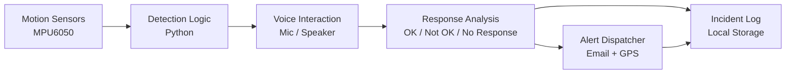

# 🚗 CrashGuard

**Smart Accident Detection & Voice-Based Emergency Response System**


CrashGuard is a real-time accident detection system built on Raspberry Pi that combines motion sensing, GPS tracking, and voice interaction to reduce emergency response time after a crash. When abnormal motion is detected, the system engages the driver in a voice-based check-in and, based on their response (or lack thereof), automatically dispatches an emergency alert with location and incident details.

> **"Detect. Confirm. Respond."**

---

## 📑 Table of Contents

- [Overview](#overview)
- [Key Features](#-key-features)
- [Hardware Used](#-hardware-used)
- [Technologies Used](#-technologies-used)
- [How It Works](#-how-it-works)
- [Alert Contents](#-alert-contents)
- [System Architecture](#-system-architecture)
- [Getting Started](#-getting-started)
- [Future Improvements](#-future-improvements)
- [Disclaimer](#️-disclaimer)
- [License](#-license)

---

## Overview

CrashGuard continuously monitors vehicle movement using an accelerometer and gyroscope. Upon detecting abnormal motion consistent with a collision, it initiates a voice interaction to confirm the driver's condition, retrieves GPS coordinates, and — depending on the outcome — automatically sends an emergency alert to designated contacts.

---

## 🔥 Key Features

| Feature | Description |
|---|---|
| 🚨 Real-Time Accident Detection | Continuous motion monitoring via accelerometer and gyroscope |
| 🎤 Voice-Based Driver Confirmation | Interactive check-in using speech recognition and TTS |
| 📍 GPS Location Tracking | Live location capture at the time of incident |
| 📧 Automatic Email Alerts | Sends incident report with location and severity |
| 🧠 Smart Decision Logic | Differentiates between confirmed-safe, confirmed-unsafe, and no-response scenarios |
| 📊 GUI Dashboard | Live monitoring interface built with Tkinter |
| 📝 Incident Logging | Persistent record of detected events and outcomes |

---

## 🧩 Hardware Used

- **Raspberry Pi** — core processing unit
- **MPU6050** — accelerometer + gyroscope for motion sensing
- **Neo-6M GPS Module** — location tracking
- **WM8960 Audio HAT** — microphone and speaker for voice interaction

---

## ⚙️ Technologies Used

- Python 3
- Raspberry Pi OS
- I2C & UART communication protocols
- Speech Recognition
- Text-to-Speech (TTS)
- Tkinter (GUI)

---

## 🧠 How It Works

1. **Monitor** — The system continuously tracks acceleration and tilt data from the MPU6050.
2. **Detect** — If abnormal motion is identified, an accident is suspected.
3. **Confirm** — The system verbally asks the driver: *"Are you okay?"*
4. **Analyze Response**:
   - ✅ **"I am okay"** → Alert is cancelled
   - ❌ **"Not okay"** → Alert is sent
   - ⏳ **No response** → Alert is sent automatically
5. **Locate** — GPS coordinates are retrieved.
6. **Alert** — An emergency email is dispatched with full incident details.

---

## 📧 Alert Contents

Each emergency alert includes:

- 📍 GPS coordinates with a Google Maps link
- ⏱️ Timestamp of the incident
- ⚠️ Severity level
- 🧾 Full incident report

---

## 🏗 System Architecture



---

## 🚀 Getting Started

### Prerequisites

- Raspberry Pi (3B+ or newer recommended)
- Python 3.7+
- MPU6050, Neo-6M GPS module, and WM8960 Audio HAT wired per hardware documentation
- Internet connectivity (for email alerts)

### Installation

```bash
# Clone the repository
git clone https://github.com/<your-username>/crashguard.git
cd crashguard

# Install dependencies
pip install -r requirements.txt

# Configure email credentials and thresholds
cp config.example.py config.py
nano config.py
```

### Running CrashGuard

```bash
python3 main.py
```

---

## 🚀 Future Improvements

- 📶 GSM module integration for SMS alerts
- 📱 Mobile app integration
- ☁️ Cloud-based incident logging
- 🤖 AI-based crash detection for improved accuracy
- 📷 Camera integration for visual incident confirmation

---

## ⚠️ Disclaimer

This is a **prototype system** designed for **educational purposes**. It may require further testing, calibration, and optimization before being considered for real-world deployment. It is not a certified safety device and should not be relied upon as a sole means of emergency response.

---

## 📄 License

This project is licensed under the [MIT License](LICENSE).

---

<div align="center">

**CrashGuard** — *Detect. Confirm. Respond.*

</div>
